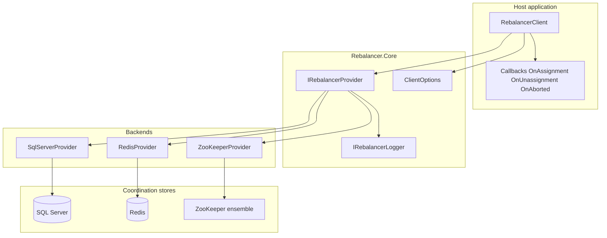

# Rebalancer — architecture overview

High-level view of the .NET solution. Libraries live under [`src/`](../../src/); samples under [`examples/`](../../examples/); automated tests under [`tests/`](../../tests/). For protocol detail, see [src/Rebalancer.ZooKeeper/README.md](../../src/Rebalancer.ZooKeeper/README.md) and [README.md](../../README.md).

**Registration:** static `Providers.Register(() => …)` **or** `Microsoft.Extensions.DependencyInjection` extensions in `src/Rebalancer.Extensions.DependencyInjection` ([ADR 0005](../adrs/0005-dependency-injection-for-provider-registration-v2.md)).
